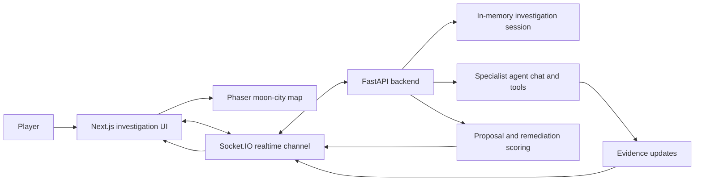

# EchoLocate

EchoLocate is a cyber forensics investigation game where players coordinate AI specialist agents to trace an incident across a moon-city infrastructure map.

## Overview

EchoLocate turns incident response into an interactive investigation loop: players explore systems, question specialist agents, collect evidence, submit reports, and execute remediations. The active product combines a Phaser-rendered city map with a Next.js interface and a FastAPI backend that streams investigator updates over Socket.IO. The technically interesting piece is the connection between gameplay state, specialist agent roles, evidence discovery, and scoring.

The intended user is a player learning or practicing cyber investigation workflows through a guided, game-like prototype.


## Tech stack

| Area | Tools |
| --- | --- |
| Frontend | Next.js, React, TypeScript, Phaser, Tailwind CSS, Motion |
| Game UI | Phaser scenes, tilemaps, custom sprites, React overlays |
| Backend | FastAPI, Python, Socket.IO, Uvicorn, Pydantic |
| AI / Agents | LangChain, OpenAI-compatible chat models, tool-calling investigator agents |
| Realtime | Socket.IO client and server events |
| Testing | Vitest, React Testing Library, Pytest |
| Tooling | Biome, uv, npm |

## Architecture



The frontend owns the playable investigation surface: landing flow, tutorial mode, map rendering, evidence feed, case board, agent roster, marketplace, and remediation UI. The backend owns session state, agent chat orchestration, tool execution, evidence updates, proposal evaluation, and remediation results.

Legacy policy-simulation and replay modules are still present in the repository, but the active product path is EchoLocate.

## Key features

* Phaser-based moon-city map using the active tilemap and tileset assets
* Specialist investigator agents for log, network, file, and timeline analysis
* Real-time streamed agent chat with thought chunks, tool activity, assistant responses, and evidence updates
* Evidence feed, case board, sector panels, recovery progress, and final claim workflow
* Agent recruiting and marketplace loop with funds, starter specialists, and purchasable agents
* Proposal evaluation and remediation actions that update recovery progress without directly revealing the hidden answer
* Tutorial mode built into the real investigation UI with guided steps and optional text-to-speech

## How it works

1. The player starts an EchoLocate investigation from the landing page.
2. The frontend opens the Phaser map and initializes an investigation session through Socket.IO.
3. The player selects systems, sends natural-language tasks to specialist agents, and receives streamed responses.
4. Backend tools inspect case data, generate evidence updates, and attach severity, confidence, and agent metadata.
5. The frontend renders evidence into the feed, case board, progress indicators, and agent UI.
6. The player submits a proposal and executes remediations against suspected systems.
7. The endgame flow evaluates the final claim and shows whether the investigation succeeded.


```bash
git clone <repo-url>
cd <repo-name>
```

Backend:

```bash
cd backend
uv sync
uv run uvicorn main:app --reload --host 0.0.0.0 --port 8000
```

Frontend:

```bash
cd frontend
npm install
npm run dev -- --port 3002
```

Open:

```text
http://localhost:3002
```

Note: the repository also includes `run.sh` and `run-start.sh`, which currently start the frontend on port `3000`.

## Environment variables

| Variable | Purpose |
| --- | --- |
| `OPENAI_API_KEY` | Chat model access for investigator agents |
| `FEATHERLESS_API_KEY` | Optional OpenAI-compatible model provider |
| `XAI_API_KEY` | Optional OpenAI-compatible model provider |
| `K2_API_KEY` | Optional OpenAI-compatible model provider |
| `GEMINI_API_KEY` | Optional Gemini model access |
| `GOOGLE_API_KEY` | Alternate Gemini key name |
| `NIPS_MODEL_NAME` | Active investigator chat model selection |
| `MODEL_NAME` | Legacy simulation model selection |
| `DEEPGRAM_API_KEY` | Text-to-speech support for radio/audio routes |
| `ELEVENLABS_API_KEY` | Speech-to-text support for radio/audio routes |
| `NEXT_PUBLIC_MOCK_BACKEND` | Enables frontend mock backend mode when set to `true` |

Do not commit real `.env` values.

## Demo


## What I would improve

* Add a sanitized `.env.example` and align local port/CORS setup for public contributors
* Persist investigation sessions instead of keeping all gameplay state in memory
* Add stronger automated coverage for the Socket.IO investigation flow
* Separate active EchoLocate code from legacy replay and policy-simulation modules
* Add observability around model latency, failed tool calls, and realtime disconnects

## Notes

This repository reflects a working prototype with both the active EchoLocate game path and older compatibility modules. The current product starts in `frontend/src/app/page.tsx`, continues through `frontend/src/app/simulate/page.tsx`, and uses the backend investigator stack in `backend/routers/nips_router.py` and `backend/nips/`.
